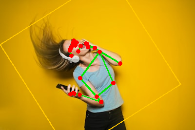

# MediaPipe-Pose (BlazePose) on the S25 Ultra Hexagon NPU

Runs the Qualcomm AI Hub [MediaPipe-Pose](https://aihub.qualcomm.com/models/mediapipe_pose)
two-stage model on the Samsung S25 Ultra's **Snapdragon 8 Elite Hexagon NPU** (SM8750),
end to end, and draws the 25-point skeleton on the input image.



The two QNN `.pte` models execute **on-device via `qnn_executor_runner` in the adb-shell
domain**. (The installed GUI app is blocked from the cDSP by Samsung SELinux — see the repo
root — but the adb-shell domain is not, so this is the working path on a stock S25 Ultra.)
The host does only image pre/post-processing and shells out to `adb` for the NPU runs.

## Pipeline

```
host: image --letterbox 128--> raw f32 NCHW tensor
adb : run pose_detector_qnn.pte on NPU   -> 4 tensors (896 anchors: boxes + scores)
host: sigmoid + anchor-decode + NMS -> best detection -> rotated ROI -> 256 crop
adb : run pose_landmark_qnn.pte on NPU   -> presence flag + 25 landmarks
host: affine-map landmarks back to image -> draw skeleton -> save PNG
```

## Verified model I/O (probed on-device, float32)

| Model | Input | Outputs |
|---|---|---|
| `pose_detector_qnn.pte`  | `(1,3,128,128)` RGB [0,1] **NCHW** | `box_coords_1 (1,512,12)`, `box_coords_2 (1,384,12)`, `box_scores_1 (1,512,1)`, `box_scores_2 (1,384,1)` |
| `pose_landmark_qnn.pte`  | `(1,3,256,256)` RGB [0,1] **NCHW** | `scores (1,)`, `landmarks (1,25,4)` = x,y,z,visibility (x,y normalized to the 256 ROI) |

> **Layout note:** these `.pte` files take **NCHW** input (empirically confirmed — NHWC gives
> all-zero detector scores). `--layout nhwc` is available if you re-export differently.

## Prerequisites

- A Samsung S25 Ultra (or any SM8750) connected via USB, debugging on; `adb` on `PATH` or `$ADB`.
- The two model files (default paths point at `~/work/s25_models/`):
  `pose_detector_qnn.pte`, `pose_landmark_qnn.pte`
- A built `qnn_executor_runner` for arm64 at
  `~/work/etbuild/executorch/build-android/examples/qualcomm/executor_runner/qnn_executor_runner`
  (produced by ExecuTorch's `backends/qualcomm/scripts/build.sh`, the same build that makes
  `qnn_llama_runner`). The script stages it + the QNN `.so` libs (reused from
  `/data/local/tmp/qwenrun`) onto the device automatically on first run.

## Setup & run

```bash
cd samples/pose
python3 -m venv .venv
./.venv/bin/python -m pip install numpy pillow

./.venv/bin/python run_pose.py --image fullbody.jpg --out result.png
```

Options: `--image` (input), `--out` (annotated PNG), `--detector`/`--landmark` (`.pte` paths),
`--layout nchw|nchw`.

Expected console output:
```
detector: max score 0.868 (threshold 0.75)
detector: 1 pose(s), best score 0.868
landmark: presence flag 1.000 (threshold 0.5)
saved result.png
```

## Files

| File | Role |
|---|---|
| `mediapipe_pose.py` | anchors (896, MediaPipe SSD), detector decode + NMS, rotated-ROI math, landmark mapping, drawing |
| `run_pose.py` | CLI orchestrator: pre/post-processing + `adb` device runs on the NPU |
| `fullbody.jpg`, `person.jpg` | sample inputs |
| `example_output.png` | sample annotated result |

## Notes / limitations

- Single highest-confidence pose per image (the detector finds all; we take the top after NMS).
- The 25-landmark skeleton is the qai "valid landmark" subset; the raw model has 31 slots and a
  segmentation head that the AI Hub wrapper drops.
- Best on upright, mostly-unoccluded subjects (BlazePose's design point). Heavily curled or
  partially-out-of-frame poses (e.g. a tight sit-up) still detect but land fewer body points.
- Anchors are generated from the standard MediaPipe `pose_detection` SSD config (128×128,
  strides [8,16,16,16] → 512+384 = 896). If a future model revision changes this, regenerate.
